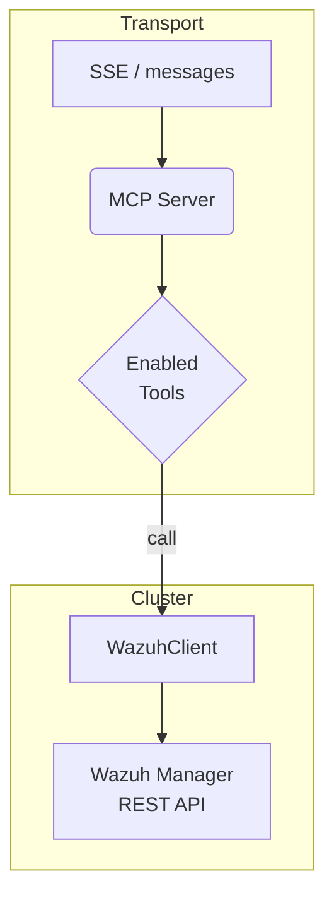

# Wazuh-MCP-Server

A **Model–Context–Protocol tool-server** that lets any MCP-aware LLM (e.g. Claude’s “Custom Tool Server”, OpenAI assistants, LangChain agents) **query and manage Wazuh Manager** over its REST API.  
It speaks the *stream transport* out-of-the-box (Server-Sent Events + OpenAI-compatible `/messages`).

> **Why?**  
> Combine the breadth of Wazuh telemetry with the reasoning power of large language models—without exposing credentials or write APIs to the model itself.

---

## ✨ Key Features

| Capability | Details |
|------------|---------|
| **Transport** | SSE endpoint (`/sse`) and OpenAI-style streaming endpoint (`/messages`) |
| **Multi-cluster** | Talk to *many* Wazuh managers; clusters are declared in YAML |
| **Built-in tools** | `AuthenticateTool` (JWT refresh) · `GetAgentsTool` (rich agent listing) |
| **Dynamic catalogue** | Plug-in architecture: drop a new `@register` function -> the LLM sees it |
| **Fine-grained filtering** | Disable tools by name/category/regex, force read-only mode |
| **Production-grade HTTP** | `httpx` with HTTP/2, connection pooling, TLS verification |
| **Stateless** | No database; JWTs live only in memory and auto-refresh 60 s before expiry |
| **Container-ready** | Single entrypoint `wazuh-mcp-server` (or `python -m wazuh_mcp_server …`) |

---

## Table of Contents
- [Quick Start](#quick-start)
- [Configuration](#configuration)
- [Environment Variables](#environment-variables)
- [Adding New Tools](#adding-new-tools)
- [Security Notes](#security-notes)
- [Deployment Patterns](#deployment-patterns)
- [Development & Testing](#development--testing)
- [Project Layout](#project-layout)
- [License](#license)

---

## Quick Start

### 1 . Install

```bash
python -m venv .venv && source .venv/bin/activate
pip install wazuh-mcp-server
```

### 2 . Describe your Wazuh managers

```yaml
# clusters.yml
clusters:
  prod:
    name: prod
    api_url: https://wazuh.company.tld:55000
    username: api-user
    password: S3cr3t!
    ssl_verify: true
  lab:
    name: lab
    api_url: https://wazuh-lab:55000
    username: wazuh
    password: lab123
    ssl_verify: false
```

### 3 . Run the server

```bash
export LOG_LEVEL=info
wazuh-mcp-server --config clusters.yml --host 0.0.0.0 --port 8080
```

Open <http://localhost:8080/health> → `{"status":"ok"}` means we’re live.

---

## Configuration

### Cluster YAML

| Field | Required | Description |
|-------|----------|-------------|
| `name` | yes | Unique handle for the cluster |
| `api_url` | yes | Base URL of the Wazuh API (`https://...:55000`) |
| `username` / `password` | yes | Basic-auth credentials used to obtain JWTs |
| `ssl_verify` | no | Set to `false` for self-signed test labs |

### Filter YAML (optional)

```yaml
filter:
  disabled_tools:
    - DeleteAgentsTool
  disabled_categories:
    - dangerous
  disabled_regex:
    - '^Shutdown.*'
```

Point to it with `WAZUH_FILTER_YAML=/etc/wazuh/filter.yml`.

---

## Environment Variables

| Variable | Purpose | Example |
|----------|---------|---------|
| `WAZUH_FILTER_YAML` | Path to extra allow/deny rules | `/etc/wazuh/filter.yml` |
| `WAZUH_DISABLED_TOOLS` | Comma-separated list of tool names to hide | `AuthenticateTool` |
| `WAZUH_DISABLED_CATEGORIES` | Comma-separated categories | `write, dangerous` |
| `WAZUH_DISABLED_TOOLS_REGEX` | Regex patterns (comma-sep) | `^Delete.*,.*Danger` |
| `WAZUH_READ_ONLY` | `true/false`. When `true`, drops any tool whose `_meta["http_method"]` is not safe (`GET|HEAD|OPTIONS`) | `true` |
| `LOG_LEVEL` | Python logging level | `debug` |

---

## Adding New Tools

1. **Define arguments**

```python
class RestartManagerArgs(BaseModel):
    cluster: str
```

2. **Implement the coroutine**

```python
@register("RestartManagerTool")
async def restart_manager(args: RestartManagerArgs, registry, **_):
    """Restart the Wazuh manager service."""
    cli = get_client(args.cluster, registry)
    r = await cli.request("PUT", "/manager/restart")
    r.raise_for_status()
    return [{"type": "text", "text": "Restart triggered"}]

# metadata (optional but recommended)
restart_manager._meta = {
    "category": "manager",
    "http_method": "PUT",
}
```

3. **Done.** It instantly appears in `/list_tools`.

---

## Security Notes

* **Credentials** – keep the YAML in a secrets store (Vault, AWS Secrets Manager) and mount at runtime.  
* **TLS** – always set `ssl_verify: true` in production.  
* **Least privilege** – create a dedicated Wazuh user with the minimal RBAC role needed by the exposed tools.  
* **Rate limiting / auth front-door** – protect `/sse` & `/messages` with a reverse proxy (NGINX, Envoy) or Starlette middleware if the server is internet-facing.

---

## Deployment Patterns

### Docker

```dockerfile
FROM python:3.12-slim
WORKDIR /app
RUN pip install wazuh-mcp-server
COPY clusters.yml /etc/wazuh/clusters.yml
EXPOSE 8080
ENTRYPOINT ["wazuh-mcp-server", "--config", "/etc/wazuh/clusters.yml", "--host", "0.0.0.0", "--port", "8080"]
```

### systemd

```ini
[Unit]
Description=Wazuh MCP Server
After=network.target

[Service]
User=wazuh
Group=wazuh
Environment="LOG_LEVEL=info"
ExecStart=/usr/local/bin/wazuh-mcp-server --config /etc/wazuh/clusters.yml --host 0.0.0.0 --port 8080
Restart=always
RestartSec=5

[Install]
WantedBy=multi-user.target
```

---

## Development & Testing

```bash
git clone https://github.com/your-org/wazuh-mcp-server.git
cd wazuh-mcp-server
python -m venv .venv && source .venv/bin/activate
pip install -r requirements.in
pip install -e .[dev]         # lint / test extras

pytest -q
```

Run with hot reload:

```bash
uvicorn wazuh_mcp_server.streaming_server:app --reload --port 8080
```

---

## Project Layout

```
src/
├─ wazuh_mcp_server/       ← runtime package
│  ├─ streaming_server.py  ← Starlette / SSE transport
│  ├─ clusters_information.py
│  ├─ client.py            ← JWT auth + HTTP plumbing
│  └─ helper.py
└─ tools/
   ├─ tools.py             ← @register catalogue
   ├─ tool_params.py
   ├─ tool_filter.py
   └─ utils.py
tests/
```



---

## License

This project is licensed under the **Apache License 2.0**.  
See `LICENSE` for the full text.
